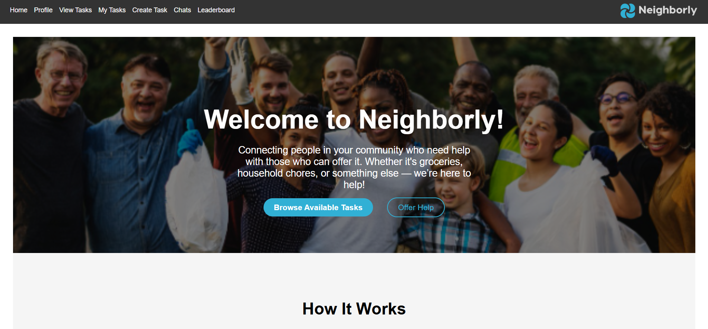
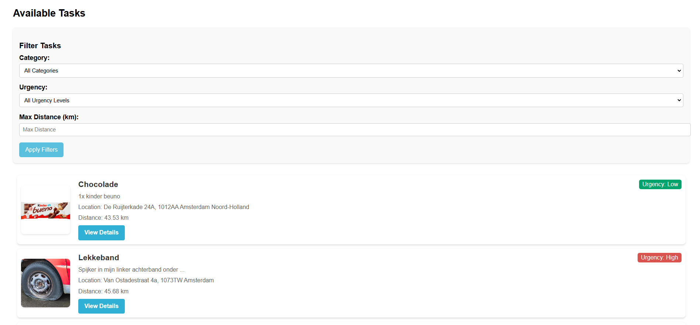
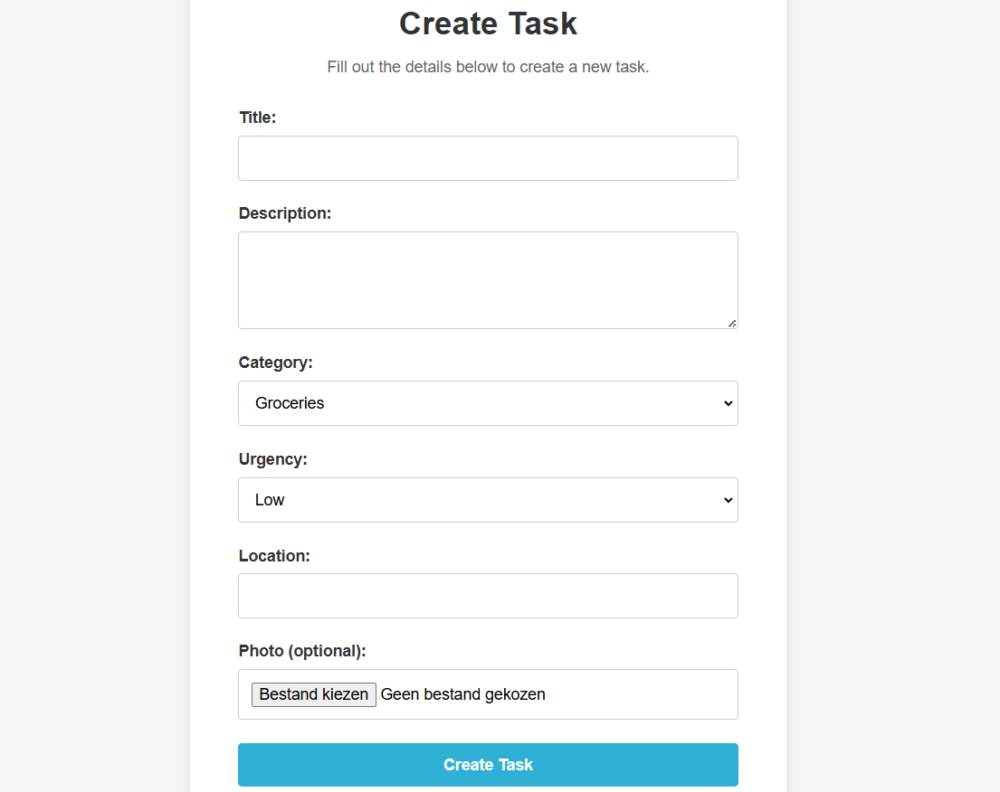
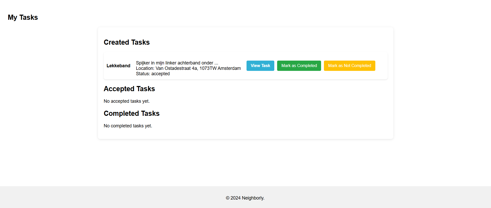
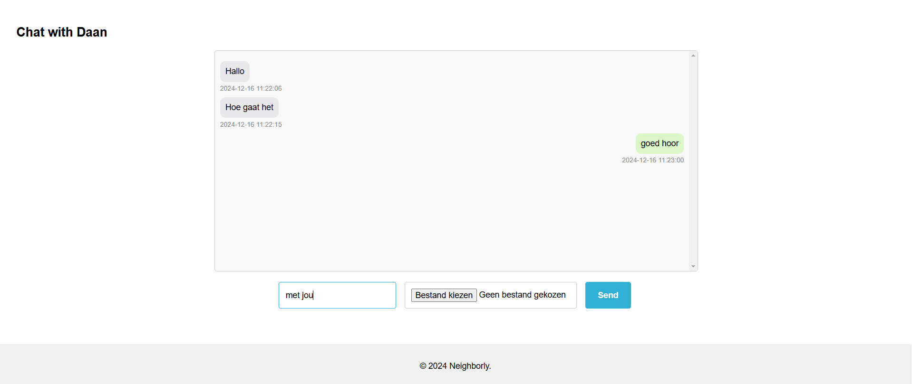
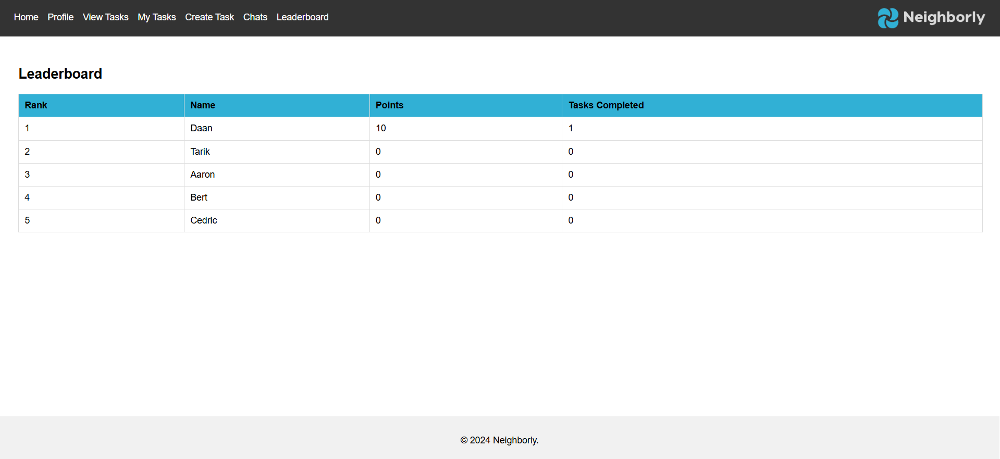

# **Project: Neighborly**  
**Van: Tarik Ulgen**
**Screencast: https://youtu.be/Qy5p4_-Matk?si=77uc3_f8nqfokvfQ**

## 🚀 **Introductie**  
**Neighborly** is een platform waarmee buurtgenoten elkaar kunnen helpen met dagelijkse taken. Gebruikers kunnen taken aanmaken en anderen uitnodigen om te helpen. Denk aan klusjes zoals boodschappen doen, het repareren van een fiets of het verzorgen van een huisdier. Gebruikers verdienen punten door taken te voltooien, waarbij urgentie het aantal punten beïnvloedt. Het doel is om gemeenschapszin te versterken en hulp laagdrempelig te maken.


## 🛠️ **Probleemomschrijving**  
In veel buurten is er een gebrek aan eenvoudige en toegankelijke manieren om hulp te vragen of aan te bieden. Mensen die kleine klusjes willen laten doen (zoals het verschuiven van een kast) of hulp nodig hebben (zoals boodschappen halen) weten vaak niet waar ze terechtkunnen. Dit probleem wordt versterkt doordat buren elkaar soms niet kennen.  

**Neighborly biedt een oplossing door:**  
1. Een platform te bieden voor hulpvragen en -aanbiedingen.  
2. Gebruikers op basis van locatie te matchen met mensen in de buurt.  
3. Taken te categoriseren, zoals huishoudelijk werk, boodschappen, of eenvoudige reparaties.  
4. Een chatfunctie toe te voegen om taakdetails te bespreken.  
5. Een leaderboard aan te bieden dat de meest behulpzame gebruikers toont.  


## 🎯 **Onze doelgroep**  
De primaire gebruikers zijn:  
- **Ouderen**: die hulp nodig hebben bij dagelijkse taken zoals boodschappen en klusjes.  
- **(Jong)volwassenen**: die tijd over hebben en graag willen bijdragen aan hun gemeenschap.  
- **Gezinnen en individuen**: die incidenteel hulp nodig hebben met specifieke taken.


## 📸 **Functionaliteiten en Screenshots**

### **Homepagina**  
De **homepagina** legt uit wat Neighborly is en biedt een duidelijke toegang tot belangrijke functies.  
  

### **Takenoverzicht**  
Op de **'View Tasks'**-pagina kun je alle openstaande taken zien. Taken kunnen worden gefilterd op basis van categorie, locatie en urgentie.  
  

### **Taak aanmaken**  
Op de **'Create Task'**-pagina kunnen gebruikers eenvoudig nieuwe taken toevoegen met titel, beschrijving, locatie en categorie.  
  

### **Mijn Taken**  
De **'My Tasks'**-pagina biedt een overzicht van taken die de gebruiker zelf heeft aangemaakt of geaccepteerd.  
  

### **Chatpagina**  
De **Chatpagina** maakt directe communicatie tussen gebruikers mogelijk over specifieke taken.  


### **Leaderboard**  
De **Leaderboard**-pagina motiveert gebruikers door de meest behulpzame personen te rangschikken op basis van behaalde punten.  
  


## ⚙️ **Installatie**  
Volg de onderstaande stappen om **Neighborly** lokaal te draaien:  

### 1. **Repository clonen**  
Clone de repository naar je lokale machine:  
```bash
git clone https://github.com/AvaTarikk/neighborly.git
```

### 2. **Navigeer naar de projectmap**  
Ga naar de projectmap met:  
```bash
cd neighborly
```

### 3. **Dependencies installeren**  
Zorg ervoor dat **Python** geïnstalleerd is en installeer de benodigde dependencies:  
```bash
pip install -r requirements.txt
```

### 4. **Database instellen**  
Initialiseer en migreer de database:  
```bash
flask db init
flask db migrate
flask db upgrade
```

### 5. **Applicatie starten**  
Start de applicatie met:  
```bash
flask run
```

De app draait nu lokaal op: **[http://localhost:5000](http://localhost:5000)**  


## 📚 **Bronnenlijst**  

### **IP Stack Implementatie**  
- **apilayer** (2023, 8 november):  
  [*How to implement ipstack in 5 minutes*](https://www.youtube.com/watch?v=UWoaDGioXuE)  

### **Socket.IO Implementatie**  
Gebruikt in `/template/chat.html`:  
1. **Socket.IO Docs** (2024, 21 oktober):  
   [*Tutorial - Introduction*](https://socket.io/docs/v4/tutorial/introduction)  
2. **freeCodeCamp.org** (2024, 18 april):  
   [*WebSockets Beginners Tutorial with Socket.IO*](https://www.youtube.com/watch?v=CzcfeL7ymbU)  

### **Haversine Functie**  
De code in `app.py` van **regel 205 t/m 225** met behulp van:  
- [*Haversine formula in Python*](https://stackoverflow.com/questions/4913349/haversine-formula-in-python-bearing-and-distance-between-two-gps-points)  

### **CSS en HTML Bronnen**  
1. **Brian Design** (2020, 14 september):  
   [*HTML CSS and Javascript Website Design Tutorial*](https://www.youtube.com/watch?v=FazgJVnrVuI)  
2. **Web Dev Simplified** (2018, 30 augustus):  
   [*How to Style a Modern Website (Part One)*](https://www.youtube.com/watch?v=Sv_NAxi_jNs)  
   

## 🔧 **Dependencies**  
- **Flask**: Framework voor de webapplicatie.  
- **SQLAlchemy**: Voor databasebeheer en ORM-functionaliteit.  
- **Flask-WTF**: Voor formuliervalidatie.  
- **IpStack**: Voor locatiebepaling en afstandsberekening.  
- **Socket.IO**: Voor de real-time chatfunctie.  
